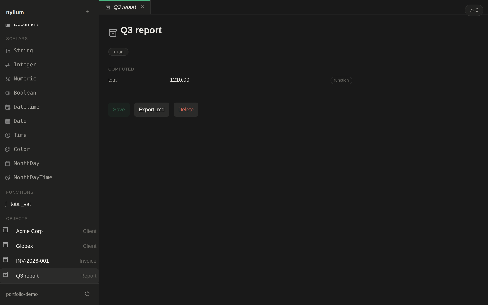

# nylium

A self-hosted **typed object store** — records are shaped by a real type system: parametric types, computed fields, file and array values.



## What it is

nylium applies a type system to a document store. You define an object type and its props; instances of that type are validated, linked, and computed accordingly. Single-user and self-hosted, designed and built solo end to end.

- **Parametric types** — `Array<T>`, `Numeric<Unit>`, `Function<T, R>`. Types take type arguments.
- **Computed props, two ways** — a lazy arithmetic formula DSL, or a visual action graph (`Function<T, R>`, Apple-Shortcuts-style) with static cycle detection at save time.
- **Files as first-class entities** — File/Document/Image live in their own table with stable uuid pointers and blob storage; a rename can never corrupt a reference.
- **Passkey auth** — WebAuthn login, no passwords anywhere.
- **Units of measure** — dimensional scalar types (`Numeric<Unit>`).
- **Embedded instances** — object instances as prop values.

## Stack

| Layer | Tech |
|---|---|
| Backend | Python, FastAPI, SQLAlchemy, PostgreSQL, py_webauthn |
| Frontend | TypeScript (strict), React 19, Vite |
| Infra | Docker (dev), systemd + Caddy (prod), self-hosted VPS |

## Engineering

- **ADR-driven design** — non-trivial decisions land in [`docs/adr/`](docs/adr/) before code (8 accepted).
- **Strict typing** — `basedpyright` at 0 errors / 0 warnings / 0 notes.
- **Test suite** — `pytest`, unit + HTTP coverage.
- **CI gates** — type check, tests, lint, and build on every push; deploy to prod gated by CI.

## Dev setup

Database (the only service that runs in Docker):

```
docker compose up -d db   # start Postgres
docker compose stop db    # stop (data persists in the db-data volume)
docker compose down -v    # stop AND wipe the database entirely
```

Copy `.env.example` to `.env` (tests and the server read `DATABASE_URL` from it):

```
cp .env.example .env
```

Backend + tests (native, via uv):

```
uv sync
uv run pytest
```

Frontend (native, via npm):

```
npm install
npm run dev      # vite dev server
npm run build    # production build into web/dist
```

If `docker compose up -d db` fails with "port 5432 is already allocated" — a leftover
local Postgres is still running (`pg_ctl -D .pgdata stop` / `brew services stop postgresql`).
